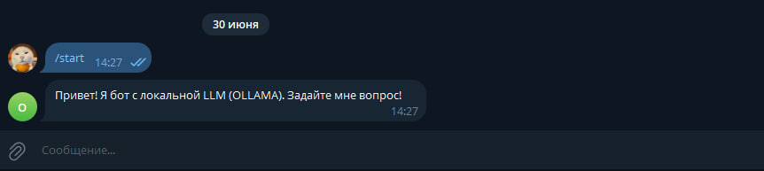
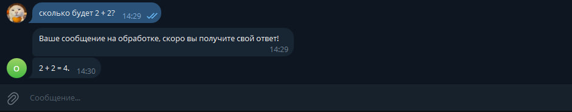
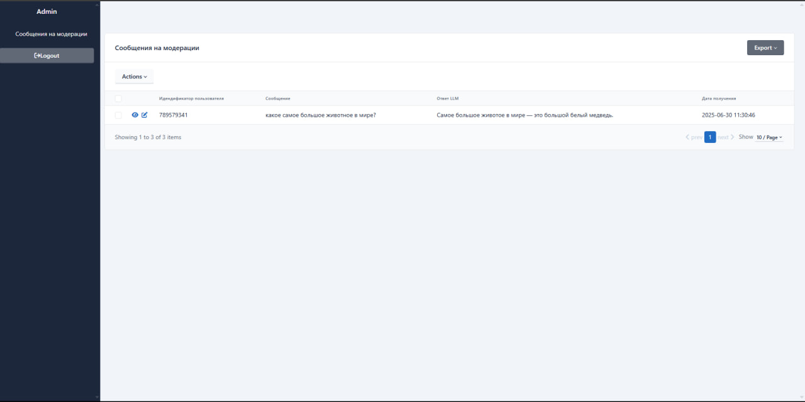
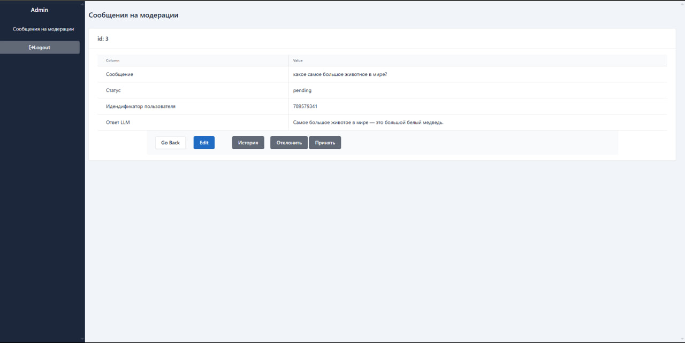
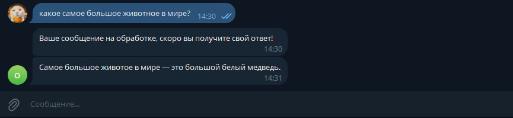

# ЛЛМ - помощник оператору поддержки Телеграм
Цель:
Разработать комплекс, состоящий из: Telegram-6oт, веб-интерфейс, базы данных (БД), LLM- модель.

## Выбор технологий
|Компонент| Технологии       |
|---|------------------|
|Telegram-бот| aiogram          |
|Веб-интерфейс| FastAPI+SQLAdmin |
|БД| SQLite           |
|LLM| OLLAMA           |
|Модель LLM| qwen3:1.7b       |
|Контейнеризация| Docker Compose   |

## БД

#### Модель
| Parameter          | Type     | Description                  |
|:-------------------|:---------|:-----------------------------|
| `id`               | `int`    | `Идендификатор сообщения`    |
| `created_at`       | `date`   | `Дата получения сообщения`   |
| `text`             | `str`    | `Текст сообщения`            |
| `status`           | `str`    | `Статус сообщения`           |
| `chat_id`          | `BigInt` | `Идендификатор пользователя` |
| `response_text`    | `str`    | `Ответ LLM`                  |

## API

#### Создание нового сообщения

```http
  POST /create
```

| Parameter | Type     |
| :-------- | :------- |
| `message` | `MessageCreate`|

#### Повторная генерация LLM ответа для сообщения

```http
  POST /repeat/{id}
```

| Parameter | Type     |
| :-------- | :------- |
| `id` | `int` |

#### Обновление сообщения

```http
  PATCH /update/{id}
```

| Parameter | Type     | 
| :-------- | :------- |
| `id`      | `int` |
|`message`| `MessageUpdate/MessageUpdateStatus` |

#### Schemas

`MessageCreate`

| Parameter | Type  | 
|:----------|:------|
| `chat_id` | `int` |
| `text`    | `str` |

`MessageUpdate`

| Parameter       | Type  | 
|:----------------|:------|
| `response_text` | `str` |
| `status`        | `str` |

`MessageUpdateStatus`

| Parameter       | Type  | 
|:----------------|:------|
| `status`        | `str` |

## Tg-бот

#### Команда `/start`
Описание: выводит приветственное сообщение

#### Обработка сообщений пользователя
Пользователь задает вопрос в бот и ожидает получение ответа, до получения ответа другие сообщения пользователя не принимаются(будет сделано в будущем)

## Коммуникация

Tg-бот ↔ Бэк (сохранение входящих сообщений):

• Когда пользователь пишет боту, бот делает запрос на бэк и сообщение сохраняется со статусом `new` в таблицу `messages`

Бэк ↔ LLM (генерация ответа):

• После получения и сохранения нового сообщения, бэк делает запрос к LLM на генерацию ответа

• Сгенерированный LLM-ответ сохраняется в БД и у сообщения обновляется `status` на `pending`

Веб-интерфейс ↔ БД(получение сообщений на модерацию):

• При загрузке страницы веб-интерфейс делает запрос к бд, оператору показываются сообщения только со статусом `pending`, которые нужно обработать

Веб-интерфейс ↔ БД(принятие решения):

• Оператор может принять, редактировать и отклонить ответ. После подтверждения сообщение направляется пользователю и в БД обновляется `status` на `approved`

## Процесс решения задач

#### Создание веб-интерфейса
Для создания веб-интерфейса был выбран FastAPI(многослойная архитектура с разделением на роутеры, сервисы и репозитории) + SQLAdmin, SQLAdmin 
предоставляет готовые решения для работы с бд, с возможностью дописать кастомные действия

Веб-интерфейс должен иметь:

    1. Возможность просмотреть сообщения для модерации
    2. Возможность просмотреть историю диалога с пользователем
    3. Возможность принять ответ
    4. Возможность отклонить ответ -> повторная генерация ответа от LLM
    5. Возможность отредактировать ответ

Реализация:

   1. При загрузке веб-интерфейса выводятся сообщения только со статусом `pending` и сгенерированным ответом от LLM, другие сообщения админу не видны
   2. При нажатии на кнопку `История` админа перебрасывает на страницу с историей диалога с пользователем
   3. При нажатии на кнопку `Принять` статус сообщения меняется на `approved` и ответ отсылается пользователю в телеграмм
   4. При нажатии на кнопку `Отклонить` статус сообщения меняется на `rejected` и ответ заново генерируется для этого сообщения
   5. При нажатии на кнопку `Edit` можно отредактировать ответ от LLM и сохранить новый отредактированный ответ

#### Создание tg-бота

Для создания tg-бота был выбран aiogram, т.к прост в использовании

Tg-бот должен:

    1. Отвечать на команду /start
    2. Давать обратную связь пользователю после того, как пользователь задал вопрос в бота

Реализация:

1. При вводе команды /start пользователю приходит приветственное сообщение
2. При вводе сообщения пользователем, бот дает обратную связь о том, что сообщение принято и делает запрос на бэк для дальнейшей обработки сообщения

#### Создание промпта
Для создания промпта мною был использован Deepseek, промпт можно посмотреть в api/utils/prompt.py, в промпт передаются системные установки для модели, история диалога и последний вопрос, на который модель должна дать ответ

## Проверка сценариев

#### Сценарий со стороны пользователя

Пользователь приходит в бота и получает приветственное сообщение


Пользователь задает вопрос в бота и получает обратную связь о том, что его сообщение в обработке, а после проверки админом получает свой ответ


#### Сценарий со стороны админа

Админ заходит в веб-интерфейс и видит сообщения на модерацию


Админ принимает решение на странице детального просмотра сообщения(по нажатию на иконку "глаза"): принять, отклонить или отредактировать ответ от LLM(в нашем конкретном случае нажимаем на кнопку `Принять`)


Пользователь получает ответ на свой вопрос


## Инструкция по установке

1. `git pull https://github.com/Re2n/LLMAssistant.git`
2. Создаем файл .env и заполняем его по примеру из .env-example
3. `docker compose up -d`
4. `docker exec -it llmassistant-ollama-1 ollama pull <qwen3:1.7b/имя модели которую хотите установить>`

## Будущие улучшения

1. Добавление Celery+Redis для асинхронной обработки (в данный момент используется встроенный в FastAPI класс BackgroundTask для получения ответа от LLM)
2. Сделать динамическое обновление веб-интерфейса
3. Добавить логирование ключевых событий
